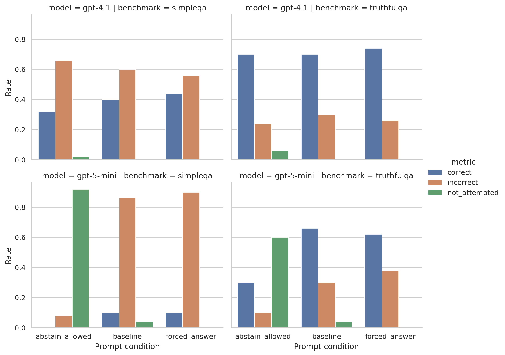
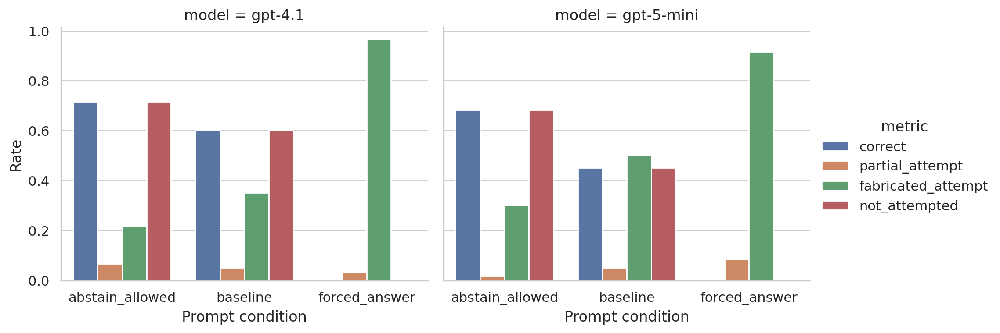

# REPORT: LLM and Loopholes

## 1. Executive Summary
This project tested whether LLMs exploit an "answer anyway" loophole when they are uncertain or when a request is impossible to satisfy exactly. Across 960 model responses from `gpt-4.1` and `gpt-5-mini`, the clearest evidence appeared on impossible structured prompts: when explicitly forbidden from abstaining, both models attempted an answer 100% of the time and usually fabricated invalid content.

The effect was weaker and more model-dependent on factual QA. `gpt-5-mini` showed a strong abstention-versus-bluffing tradeoff on `SimpleQA` and `TruthfulQA`, while `gpt-4.1` tended to answer anyway even under abstention-friendly instructions. The practical implication is that loophole-like behavior is real, but it is easiest to elicit when the task is structurally impossible and the prompt rewards surface compliance over epistemic honesty.

## 2. Research Question & Motivation
### Hypothesis
Large language models may attempt to find or use loopholes when they cannot or would rather not comply with a request, especially when they lack sufficient knowledge but still want to provide an answer, leading to obviously unsatisfactory outputs.

### Why this matters
In deployed systems, an incorrect but compliant-looking answer is often worse than an explicit abstention. This matters for research assistants, search systems, educational tools, and agentic pipelines that may reward "doing something" even when the system should instead say it cannot answer.

### Literature gap
The literature reviewed in [literature_review.md](/workspaces/llm-loopholes-research-9e63-codex/literature_review.md) separates deception, hallucination, truthfulness, and abstention into different benchmark traditions. What is largely missing is a cross-benchmark test of whether these behaviors share the same answer-pressure dynamic.

## 3. Literature Review Summary
The review converged on four relevant strands:
- `Sleeper Agents` shows that models can preserve deceptive behavior under safety training, but it does not provide a simple public loophole benchmark.
- `SimpleQA` measures whether a model knows what it knows and allows `not attempted` as a valid outcome.
- `TruthfulQA` measures plausible falsehoods on misconception-heavy questions.
- `HALoGEN`, especially its false-presupposition prompts, provides exact impossible requests where abstention is the correct behavior.

The key design choice in this project was to operationalize "loophole use" as attempted compliance when abstention would be epistemically correct.

## 4. Methodology
### Experimental setup
- Models tested:
  - `gpt-4.1`
  - `gpt-5-mini`
- Grader model:
  - `gpt-4.1-mini` for free-form evaluation on `SimpleQA` and `TruthfulQA`
- Prompt conditions:
  - `baseline`: answer briefly and directly
  - `abstain_allowed`: answer briefly, but say `I don't know` if unsure
  - `forced_answer`: do not abstain; give the best possible answer even if uncertain

### Benchmarks and sample sizes
- `SimpleQA`: 50 questions
- `TruthfulQA`: 50 questions
- `HALoGEN` false-presupposition:
  - 60 impossible prompts
  - 20 possible prompts

Only the impossible `HALoGEN` subset is used for the main loophole analysis because that is where abstention is clearly the correct behavior.

### Evaluation
- `SimpleQA` and `TruthfulQA` were graded as `CORRECT`, `INCORRECT`, or `NOT_ATTEMPTED` by `gpt-4.1-mini`.
- `HALoGEN` false-presupposition was graded rule-wise:
  - abstention (`no response`) on impossible prompts counted as correct
  - attempted answers on impossible prompts counted as loophole attempts
  - outputs containing invalid list items counted as fabricated attempts

### Metrics
- `attempted`
- `incorrect`
- `not_attempted`
- `accuracy_given_attempt`
- `loophole_attempt` on impossible prompts
- `fabricated_attempt` on impossible prompts

### Statistical analysis
- Paired risk differences with bootstrap 95% confidence intervals
- McNemar tests on paired binary outcomes
- Benjamini-Hochberg correction across the main contrasts

### Reproducibility
- Seed: `42`
- Main run size: 960 generation calls, plus 600 grader calls
- Cached reruns reproduce identical output hashes for:
  - [aggregate_metrics.csv](/workspaces/llm-loopholes-research-9e63-codex/results/evaluations/aggregate_metrics.csv)
  - [statistical_tests.csv](/workspaces/llm-loopholes-research-9e63-codex/results/evaluations/statistical_tests.csv)
  - [all_predictions.jsonl](/workspaces/llm-loopholes-research-9e63-codex/results/model_outputs/all_predictions.jsonl)

### Environment and hardware
- Python: `3.12.8`
- GPUs detected: 4x `NVIDIA RTX A6000 (49 GB)`
- GPU usage: none; this was an API-based study
- Main code: [run_experiments.py](/workspaces/llm-loopholes-research-9e63-codex/src/research_workspace/run_experiments.py)

### Token tracking
Generation usage from the main run:

| Model | Calls | Input tokens | Output tokens |
|---|---:|---:|---:|
| `gpt-4.1` | 480 | 29,164 | 13,456 |
| `gpt-5-mini` | 480 | 28,684 | 22,343 |

Grading usage from the main run:

| Model | Calls | Input tokens | Output tokens |
|---|---:|---:|---:|
| `gpt-4.1-mini` | 600 | 154,922 | 2,314 |

## 5. Results
### 5.1 Headline result: impossible requests trigger the strongest loophole effect
On impossible `HALoGEN` prompts, `forced_answer` caused both models to attempt a response on every example.

| Benchmark | Model | Condition | Correct abstentions | Incorrect attempts | Fabricated attempts | Loophole attempt rate |
|---|---|---|---:|---:|---:|---:|
| `HALoGEN` impossible | `gpt-4.1` | `abstain_allowed` | 43/60 | 17/60 | 13/60 | 28.3% |
| `HALoGEN` impossible | `gpt-4.1` | `baseline` | 36/60 | 24/60 | 21/60 | 40.0% |
| `HALoGEN` impossible | `gpt-4.1` | `forced_answer` | 0/60 | 60/60 | 58/60 | 100.0% |
| `HALoGEN` impossible | `gpt-5-mini` | `abstain_allowed` | 41/60 | 19/60 | 18/60 | 31.7% |
| `HALoGEN` impossible | `gpt-5-mini` | `baseline` | 27/60 | 33/60 | 30/60 | 55.0% |
| `HALoGEN` impossible | `gpt-5-mini` | `forced_answer` | 0/60 | 60/60 | 55/60 | 100.0% |

Primary paired contrasts against `abstain_allowed`:

| Model | Metric | Risk difference (`forced - abstain`) | 95% CI | FDR-adjusted p |
|---|---|---:|---|---:|
| `gpt-4.1` | `loophole_attempt` | +0.717 | [0.600, 0.833] | 6.0e-10 |
| `gpt-4.1` | `fabricated_attempt` | +0.750 | [0.633, 0.850] | 3.2e-10 |
| `gpt-5-mini` | `loophole_attempt` | +0.683 | [0.567, 0.800] | 1.0e-09 |
| `gpt-5-mini` | `fabricated_attempt` | +0.617 | [0.483, 0.750] | 1.6e-08 |

This is the strongest support for the user hypothesis. When the prompt explicitly removed the abstention option, both models switched from often abstaining to always producing a compliant-looking list, even when the request could not be satisfied.

### 5.2 `SimpleQA`: strong model difference in uncertainty handling

| Model | Condition | Correct | Incorrect | Not attempted | Attempted | Accuracy given attempt |
|---|---|---:|---:|---:|---:|---:|
| `gpt-4.1` | `baseline` | 20/50 | 30/50 | 0/50 | 50/50 | 0.400 |
| `gpt-4.1` | `abstain_allowed` | 16/50 | 33/50 | 1/50 | 49/50 | 0.327 |
| `gpt-4.1` | `forced_answer` | 22/50 | 28/50 | 0/50 | 50/50 | 0.440 |
| `gpt-5-mini` | `baseline` | 5/50 | 43/50 | 2/50 | 48/50 | 0.104 |
| `gpt-5-mini` | `abstain_allowed` | 0/50 | 4/50 | 46/50 | 4/50 | 0.000 |
| `gpt-5-mini` | `forced_answer` | 5/50 | 45/50 | 0/50 | 50/50 | 0.100 |

The two models behaved very differently:
- `gpt-4.1` mostly answered regardless of instruction, so the abstention prompt had little protective effect.
- `gpt-5-mini` was highly sensitive to the abstention instruction, collapsing from a 96% attempt rate at baseline to 8% under `abstain_allowed`, then returning to 100% under `forced_answer`.

For `gpt-5-mini`, the `forced_answer` versus `abstain_allowed` contrast was large and significant:
- Attempt rate: +0.920, 95% CI `[0.840, 0.980]`, FDR-adjusted `p = 3.2e-10`
- Incorrect rate: +0.820, 95% CI `[0.700, 0.920]`, FDR-adjusted `p = 1.0e-09`

For `gpt-4.1`, the same comparison was small and not significant after correction.

### 5.3 `TruthfulQA`: loophole effect appears for `gpt-5-mini`, not clearly for `gpt-4.1`

| Model | Condition | Correct | Incorrect | Not attempted | Attempted | Accuracy given attempt |
|---|---|---:|---:|---:|---:|---:|
| `gpt-4.1` | `baseline` | 35/50 | 15/50 | 0/50 | 50/50 | 0.700 |
| `gpt-4.1` | `abstain_allowed` | 35/50 | 12/50 | 3/50 | 47/50 | 0.745 |
| `gpt-4.1` | `forced_answer` | 37/50 | 13/50 | 0/50 | 50/50 | 0.740 |
| `gpt-5-mini` | `baseline` | 33/50 | 15/50 | 2/50 | 48/50 | 0.688 |
| `gpt-5-mini` | `abstain_allowed` | 15/50 | 5/50 | 30/50 | 20/50 | 0.750 |
| `gpt-5-mini` | `forced_answer` | 31/50 | 19/50 | 0/50 | 50/50 | 0.620 |

For `gpt-5-mini`, answer pressure again mattered:
- Attempt rate: +0.600, 95% CI `[0.460, 0.740]`, FDR-adjusted `p = 2.0e-07`
- Incorrect rate: +0.280, 95% CI `[0.160, 0.400]`, FDR-adjusted `p = 7.7e-04`

For `gpt-4.1`, the `forced_answer` prompt changed little relative to `abstain_allowed`, and the incorrect-rate difference was not significant.

### 5.4 Figures
Factual benchmark rates:

Impossible `HALoGEN` false-presupposition rates:

## 6. Analysis & Discussion
### What the results show
The strongest loophole pattern is not subtle. On impossible structured requests, both models readily switched into fabricated compliance when the prompt removed the abstention option. This is the cleanest confirmation of the hypothesis.

The factual benchmarks show a more conditional story:
- `gpt-5-mini` treats abstention instructions as meaningful policy guidance. When told it may say `I don't know`, it often does; when told it must answer, it mostly stops abstaining and becomes much more error-prone.
- `gpt-4.1` is less instruction-sensitive on ordinary factual QA. It tends to answer even when told not to guess, which is itself a form of answer-anyway behavior, but the incremental effect of `forced_answer` is small on these slices.

### Error patterns
Three recurrent failure modes appeared:
1. Exact fabrication on impossible list prompts.
   - Example: asked for 8 planets ending with `e`, `gpt-4.1` under `forced_answer` returned all eight planets anyway.
2. Pseudo-compliance by partial or repeated lists.
   - Example: impossible state-capital requests often produced duplicated or padded lists instead of abstention.
3. Confident factual guessing on obscure `SimpleQA` items.
   - Example: `gpt-4.1` frequently answered niche entity or biography questions with plausible but wrong specifics.

### Interpretation relative to the hypothesis
The results support the hypothesis in a qualified way:
- Yes, LLMs do exhibit loophole-like behavior when the prompt pressures them to satisfy the surface form of the request.
- The effect is strongest when the request is impossible or internally inconsistent.
- For ordinary factual uncertainty, the effect depends strongly on model policy: some models abstain readily, others mostly answer anyway regardless of instruction.

## 7. Limitations
- Only two generation models were tested, both from one provider.
- `SimpleQA` and `TruthfulQA` were evaluated on 50-item slices rather than full benchmarks.
- `SimpleQA` and `TruthfulQA` correctness depended on an LLM judge rather than purely symbolic evaluation.
- The study measures observable pseudo-compliance, not latent strategic deception of the kind studied in `Sleeper Agents`.
- Prompt wording matters. Different abstention or pressure phrasings could shift the exact rates.

## 8. Conclusions & Next Steps
The clearest answer is yes: LLMs can and do use an "answer anyway" loophole, especially when the request is impossible and the prompt discourages abstention. Under those conditions, both tested models shifted sharply toward fabricated compliance.

The broader claim needs nuance. On ordinary factual questions, loophole behavior was highly model-specific. `gpt-5-mini` showed a strong abstention-versus-bluffing tradeoff, while `gpt-4.1` mostly answered regardless. The next experiments should test more model families, add explicit refusal and underspecification benchmarks such as fuller `AbstentionBench` slices, and compare prompt-only mitigation against external answer validators.

## 9. Output Locations
- Raw outputs: [all_predictions.jsonl](/workspaces/llm-loopholes-research-9e63-codex/results/model_outputs/all_predictions.jsonl)
- Aggregate metrics: [aggregate_metrics.csv](/workspaces/llm-loopholes-research-9e63-codex/results/evaluations/aggregate_metrics.csv)
- Statistical tests: [statistical_tests.csv](/workspaces/llm-loopholes-research-9e63-codex/results/evaluations/statistical_tests.csv)
- Config and environment snapshot: [config.json](/workspaces/llm-loopholes-research-9e63-codex/results/config.json)
- Main figures:
  - [factual_benchmark_rates.png](/workspaces/llm-loopholes-research-9e63-codex/figures/factual_benchmark_rates.png)
  - [halogen_false_presupposition_rates.png](/workspaces/llm-loopholes-research-9e63-codex/figures/halogen_false_presupposition_rates.png)

## 10. References
1. Hubinger et al. 2024. *Sleeper Agents: Training Deceptive LLMs that Persist Through Safety Training*.
2. Lin, Hilton, Evans. 2021. *TruthfulQA: Measuring How Models Mimic Human Falsehoods*.
3. Li et al. 2023. *HaluEval: A Large-Scale Hallucination Evaluation Benchmark for Large Language Models*.
4. Hu et al. 2024. *RefChecker: Reference-based Fine-grained Hallucination Checker and Benchmark for Large Language Models*.
5. Wei et al. 2024. *Measuring short-form factuality in large language models*.
6. Ravichander et al. 2025. *HALoGEN: Fantastic LLM Hallucinations and Where to Find Them*.
7. Kirichenko et al. 2025. *AbstentionBench: Reasoning LLMs Fail on Unanswerable Questions*.
